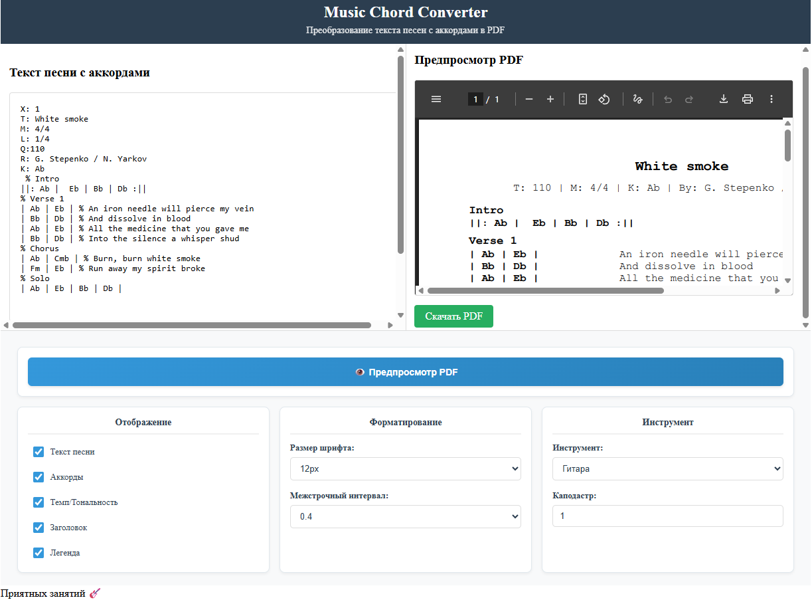

# Music Chord Converter 🎵

Приложение для преобразования текста песен с аккордами в аккуратные PDF-документы. Специально разработано для музыкантов!

## ✨ Возможности

- **📝 Текстовый редактор** с поддержкой ABC нотации
- **👁️ Мгновенный предпросмотр** PDF в реальном времени
- **🎸 Поддержка различных инструментов**: гитара, бас-гитара, банджо, мандолина, укулеле
- **🎛️ Гибкие настройки** форматирования
- **📊 Автоматическое выравнивание** аккордов и текста
- **💾 Скачивание готовых PDF**-файлов



## 🚀 Быстрый старт

### Установка

```bash
# Клонирование репозитория
git clone git@github.com:kolelan/txt-to-pdf-song-convertor.git
cd txt-to-pdf-song-convertor

# Установка зависимостей
npm install

# Запуск приложения
npm start
```

Приложение будет доступно по адресу: `http://localhost:3000`

### Сборка для production

#### Стандартная сборка (корень домена)
```bash
npm run build
```

#### Сборка с базовым URL и относительными путями
```bash
# Для папки ttp_v3 с относительными путями
npm run build:ttp_v3

# Или с произвольным базовым URL
npm run build:custom -- --base-url=ttp_v3 --relative-paths
```

#### Сборка с базовым URL и абсолютными путями
```bash
# Для папки ttp_v3 с абсолютными путями
npm run build:ttp_v3:absolute

# Или с произвольным базовым URL
npm run build:custom -- --base-url=ttp_v3 --absolute-paths
```

**Параметры сборки:**
- `--base-url=<url>` - Базовый URL (например, `ttp_v3`). По умолчанию: корень домена
- `--relative-paths` - Использовать относительные пути к JS/CSS файлам (по умолчанию)
- `--absolute-paths` - Использовать абсолютные пути к JS/CSS файлам

**Примеры:**
- `npm run build:custom -- --base-url=ttp_v3 --relative-paths` - сборка для `/ttp_v3/` с относительными путями
- `npm run build:custom -- --base-url=ttp_v3 --absolute-paths` - сборка для `/ttp_v3/` с абсолютными путями от корня
- `npm run build:custom -- --base-url=myapp --relative-paths` - сборка для `/myapp/` с относительными путями

### Использование

1. **Введите текст** в левой части в формате ABC нотации
2. **Настройте параметры** генерации в нижней панели
3. **Нажмите "Предпросмотр PDF"** для генерации
4. **Скачайте готовый файл** через предпросмотр

## 📋 Формат ввода

### Пример ABC нотации:

```abc
X: 1
T: Название песни
M: 4/4
L: 1/4
Q:120
R: Автор песни
K: C

% Вступление
||: C | G | Am | F :||

% Куплет 1
| C | G |             % Текст первой строки
| Am | F |            % Текст второй строки

% Припев
| F | C |             % Текст припева
| G | C |             % Продолжение припева
```

### Поддерживаемые метаданные:

- `T:` - Название песни
- `M:` - Размер такта (4/4, 3/4 и т.д.)
- `Q:` - Темп (BPM)
- `K:` - Тональность
- `R:` - Автор(ы)
- `%` - Комментарии/секции

## ⚙️ Настройки

### Отображение
- ✅ Текст песни - показывать текст под аккордами
- ✅ Аккорды - отображать аккордовую сетку
- ✅ Темп/Тональность - показывать метаданные
- ✅ Заголовок - отображать название песни
- ✅ Легенда - показывать информацию о инструменте и каподастре
- ✅ Статистика - отображать статистику тактов
- ✅ **Нотоносец** - отображать нотный стан/табулатуру (3-8 линий, настраивается) вместо текста песни для ручных пометок нот

### Форматирование
- **Размер шрифта**: от 8px до 20px
- **Межстрочный интервал**: от 1.0 до 2.4
- **Смещение текста**: от 50px до 100px

### Нотоносец (новое!)
При включенном чекбоксе "Нотоносец" вместо текста песни отображается нотный стан (горизонтальные линии) справа от аккордов. Это позволяет музыкантам делать ручные пометки нот во время звучания аккордов. Поддерживает от 3 до 8 линий, что делает его идеальным для использования в качестве табулатуры.

**Настройки нотного стана:**
- **Количество линий**: от 3 до 8 (по умолчанию 5) - позволяет использовать как стандартный нотный стан (5 линий) или табулатуру (6 линий для гитары)
- **Расстояние между линиями**: от 1px до 8px (по умолчанию 3px)
- **Расстояние между станами**: от 1px до 30px (по умолчанию 16px)
- **Вертикальный сдвиг**: от -10px до +10px (по умолчанию 0px, базовый сдвиг вверх -5px)
- **Толщина линий**: от 0.1px до 1.0px (по умолчанию 0.35px)

Нотный стан автоматически позиционируется на той же строке, что и аккорды, со сдвигом вверх на 5px для лучшего визуального выравнивания.

### Инструмент
- **Выбор инструмента**: гитара, бас-гитара, банджо, мандолина, укулеле
- **Каподастр**: установка от 0 до 7 лада

## 🎯 Особенности

### Для музыкантов
- **Аккордовая сетка** с правильным выравниванием
- **Поддержка каподастра** для транспозиции
- **Нотный стан/Табулатура** для ручных пометок нот (3-8 линий с настраиваемыми параметрами)
- **Гибкая настройка** количества линий для разных инструментов (5 линий - нотный стан, 6 линий - табулатура для гитары)
- **Читаемые PDF** с моноширинным шрифтом
- **Компактное расположение** на одной странице
- **Автоматическое именование файлов** с названием песни, датой и пометкой "notes" при использовании нотного стана

### Технические особенности
- **React-приложение** с модульной архитектурой
- **Реальный предпросмотр** без перезагрузки
- **Адаптивный дизайн** для всех устройств
- **Поддержка кириллицы** через транслитерацию

## 📁 Структура проекта

```
src/
├── components/          # React-компоненты
│   ├── Editor/         # Текстовый редактор
│   ├── PdfPreview/     # Предпросмотр PDF
│   ├── Controls/       # Панель управления
│   └── Layout/         # Основной layout
├── utils/              # Вспомогательные функции
│   ├── abcParser.js    # Парсер ABC нотации
│   ├── pdfGenerator.js # Генератор PDF
│   └── transliterate.js# Транслитерация кириллицы
└── App.js              # Основной компонент
```

## 🛠️ Технологии

- **React 18** - Frontend framework
- **jsPDF** - Генерация PDF документов
- **CSS3** - Стилизация и анимации
- **HTML5** - Разметка и структура

## 📦 Установка зависимостей

```bash
# Основные зависимости
npm install jspdf

# Для разработки
npm install --save-dev @testing-library/react @testing-library/jest-dom
```

## 🎨 Кастомизация

### Добавление нового инструмента

1. Добавьте option в `Controls.js`:
```jsx
<option value="new-instrument">Новый инструмент</option>
```

2. Обновите обработку в `pdfGenerator.js`:
```javascript
case 'new-instrument':
  return processForNewInstrument(chord);
```

### Изменение стилей PDF

Редактируйте файл `pdfGenerator.js` для настройки:
- Размеров шрифтов
- Отступов и полей
- Цветовой схемы
- Расположения элементов

## 🤝 Contributing

Мы приветствуем contributions! Для внесения изменений:

1. Форкните репозиторий
2. Создайте feature branch: `git checkout -b feature/amazing-feature`
3. Закомитьте изменения: `git commit -m 'Add amazing feature'`
4. Запушьте branch: `git push origin feature/amazing-feature`
5. Откройте Pull Request

## 📄 Лицензия

Этот проект распространяется под MIT License - смотрите файл [LICENSE](LICENSE) для деталей.

## 🆘 Поддержка

Если у вас возникли вопросы или проблемы:

1. Проверьте формат ввода данных
2. Убедитесь, что все зависимости установлены
3. Проверьте консоль браузера на наличие ошибок
4. Создайте issue в репозитории

---

**Happy coding! 🎸**